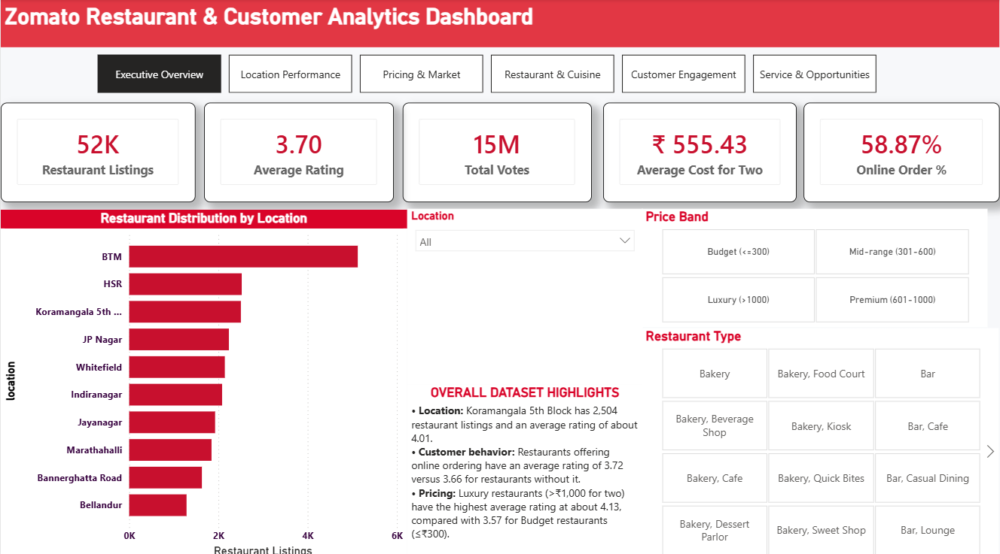
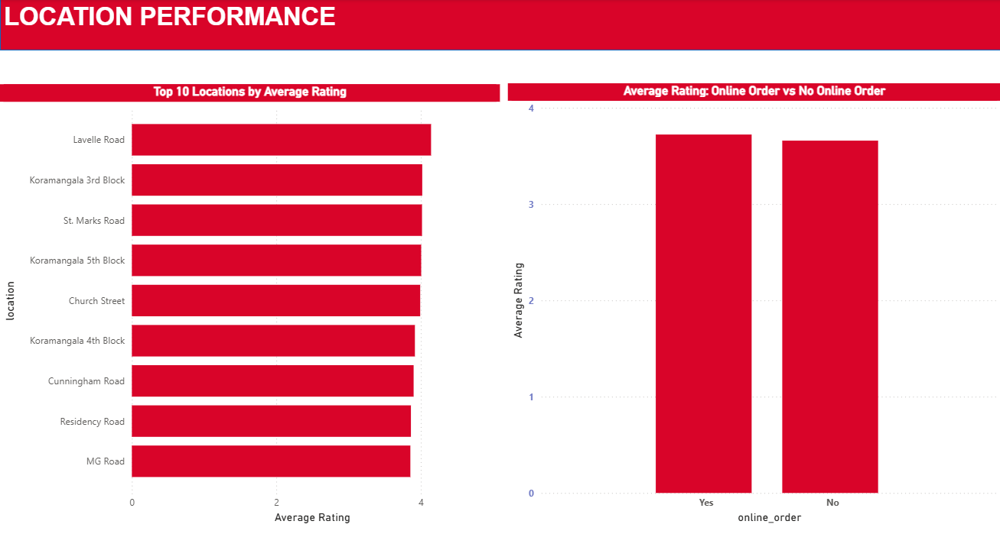
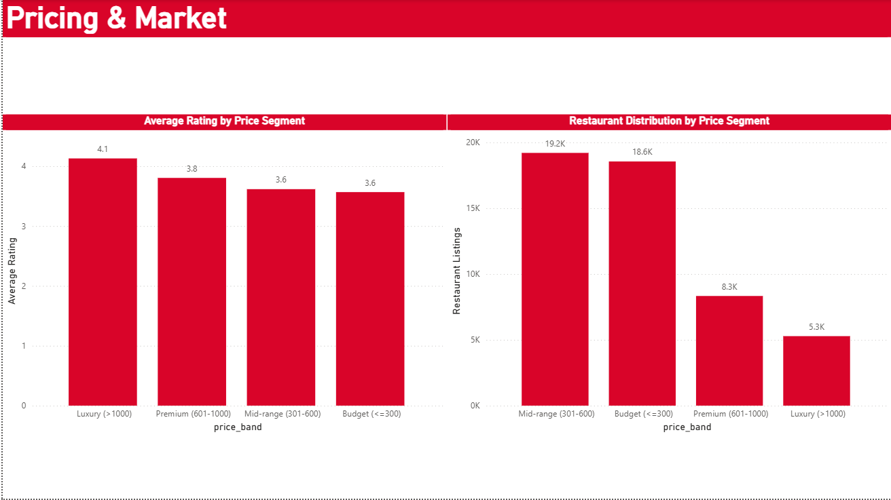
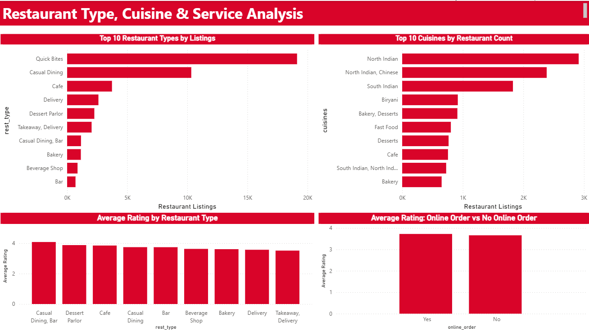
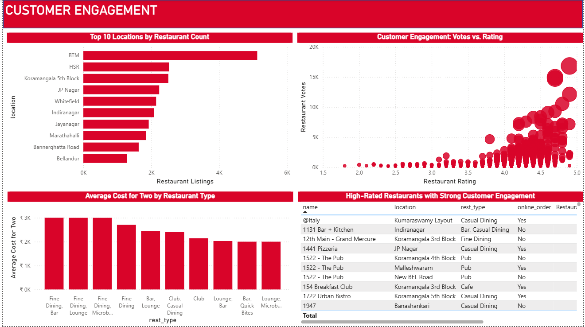
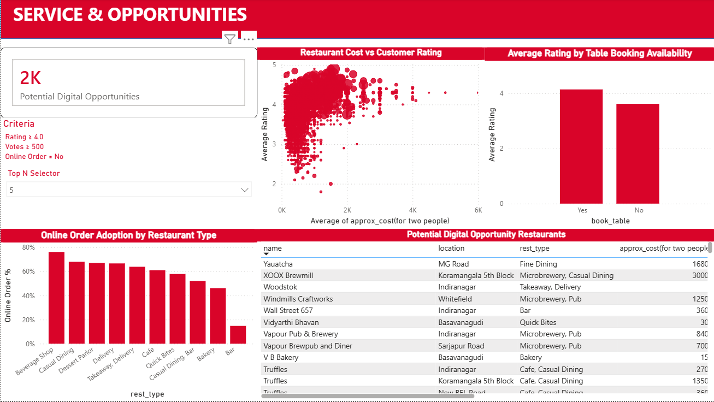

# Zomato Restaurant & Customer Analytics Dashboard

## 📊 Project Overview

An interactive Power BI dashboard developed to analyze Bangalore's restaurant ecosystem using restaurant listings, customer ratings, votes, pricing, cuisines, restaurant types, online-order availability, and table-booking information.

The project follows an end-to-end BI workflow:

Raw Data → Power Query → Data Cleaning → Data Modeling → DAX → Interactive Dashboard → Business Insights

---

## 🎯 Business Objective

The dashboard is designed to answer four key questions:

1. Where are restaurants most concentrated?
2. Which restaurant types and cuisines dominate?
3. How do pricing, ratings, and customer engagement relate?
4. Which highly rated and highly engaged restaurants represent potential digital-ordering opportunities?

---

## 🛠️ Tools & Technologies

- Power BI
- Power Query
- DAX
- Data Modeling
- Data Cleaning & Transformation
- Data Visualization

---

## 🧹 Data Preparation

The raw Zomato dataset was cleaned and transformed using Power Query.

Key steps included:

- Standardizing text fields and missing-value representations
- Converting restaurant ratings such as `4.1/5` into numeric values
- Converting votes and restaurant cost into numerical fields
- Handling missing restaurant types and cuisines
- Validating categorical fields such as online ordering and table booking
- Checking exact duplicate records
- Creating rating and price-band analytical categories
- Creating a separate cuisine analysis table to preserve the restaurant-level grain

---

## 📈 Dashboard Features

### Executive Overview

- Restaurant Listings
- Average Rating
- Total Votes
- Average Cost for Two
- Online Order %
- Location, Price Band and Restaurant Type filters

### Location Performance

- Top locations by restaurant count
- Top locations by average rating
- Location-based interactive filtering

### Pricing & Market

- Average Rating by Price Segment
- Restaurant Distribution by Price Segment

### Restaurant & Cuisine

- Top restaurant types
- Top cuisines
- Average rating by restaurant type
- Online-order vs rating analysis

### Customer Engagement

- Customer engagement analysis using ratings and votes
- Restaurant cost vs customer rating
- High-rated restaurant analysis

### Service & Opportunities

- Potential Digital Opportunity KPI
- Online-order adoption by restaurant type
- Table-booking analysis
- Dynamic Top-N analysis
- Restaurant engagement ranking
- Potential Digital Opportunity Restaurants

---

## 🧠 Advanced DAX

The project includes:

- `RANKX`
- `ALLSELECTED`
- `SWITCH`
- Dynamic Top-N parameter
- Restaurant-level rating and vote measures
- Opportunity segmentation

### Potential Digital Opportunity

Restaurants meeting all of the following criteria:

- Rating ≥ 4.0
- Votes ≥ 500
- Online Order = No

This represents a **potential opportunity segment for further investigation**, rather than proof that the restaurant should adopt online ordering.

---

## 🔄 Interactivity

The dashboard includes:

- Synced Location slicer
- Synced Price Band slicer
- Synced Restaurant Type slicer
- Page navigation
- Dynamic Top-N selection
- Interactive cross-filtering

---

## 📸 Dashboard Preview

### Executive Overview



### Location Performance



### Pricing & Market



### Restaurant & Cuisine



### Customer Engagement



### Service & Opportunities



---

## 📁 Project Structure

```text
zomato-restaurant-analytics-powerbi/
│
├── README.md
├── Zomato_Restaurant_Analytics.pbix
│
├── screenshots/
│   ├── executive-overview.png
│   ├── location-performance.png
│   ├── pricing-market.png
│   ├── restaurant-cuisine.png
│   ├── customer-engagement.png
│   └── service-opportunities.png
│
└── documentation/
    └── zomato_cleaning_log.csv